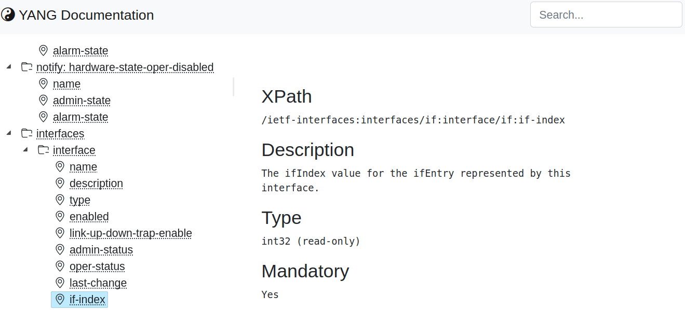

YANG Documentation Viewer
=========================

Very limited YANG Documentation generator based on libyang, with similar
output to that of `pyang -f jstree`.  The default output is a standalone
HTML file, called `yangdoc.html`, that can be included in documentation
bundles.


Usage
-----

See below [setup instructions](#setup) first.

```
~/src/yangdoc(main)$ python main.py -p yang -m ietf-system -e authentication -e local-users -e ntp -e ntp-udp-port -e timezone-name -m ietf-interfaces -e if-mib
INFO: Parsing ietf-system, enabling features: ['authentication', 'local-users', 'ntp', 'ntp-udp-port', 'timezone-name']
WARNING: Warning: failed to parse module: Data model "ietf-netconf-acm" not found in local searchdirs.: Loading "ietf-netconf-acm" module failed.: Parsing module "ietf-system" failed.
INFO: Parsing ietf-interfaces, enabling features: ['if-mib']
INFO: Processing module ietf-interfaces
INFO: HTML file generated: yangdoc.html
x-www-browser yang_tree_view.html
~/src/yangdoc(main)$ x-www-browser yang_tree_view.html
```


Screenshot
----------




Setup
-----

> These instructions have been tested on Linux Mint 21.3, but
> are mostly the same for other operating systems.

Clone the repository to your home directory:

```
~$ cd src/
~/src$ git clone https://github.com/troglobit/yangdoc
~/src$ cd yangdoc
~/src/yangdoc(main)$
```

Set up your virtual environment, this ensures all python packages
installed from `requirements.txt` are installed only in `.venv/`:

```
~/src/yangdoc(main)$ python -m venv .venv
~/src/yangdoc(main)$ source .venv/bin/activate
```

Install all required packages:

```
~/src/yangdoc(main)$ sudo apt install libyang2
~/src/yangdoc(main)$ pip install -r requirements.txt
```


Developer Notes
---------------

Use `pip-compile` from pip-tools to [manage Python requirements][4],
this makes life a lot easier since we only need pyproject.toml for all
our packaging needs.

To install locally, or just build, verifying pyproject.toml:

```
~/src/yangdoc(main)$ pip install -e .
~/src/yangdoc(main)$ python -m build
```

For uploading to PyPi, remember to install twine:

```
~/src/yangdoc(main)$ pip install twine
```

Then build and test upload:

```
~/src/yangdoc(main)$ python -m build
~/src/yangdoc(main)$ twine upload --repository-url https://test.pypi.org/legacy/ dist/*
```

Verify upload and then upload to PyPi proper:

```
~/src/yangdoc(main)$ twine upload dist/*
```


[1]: https://massimilianobruni-92986.medium.com/fix-your-python-requirements-with-pip-tools-856765d8c061
